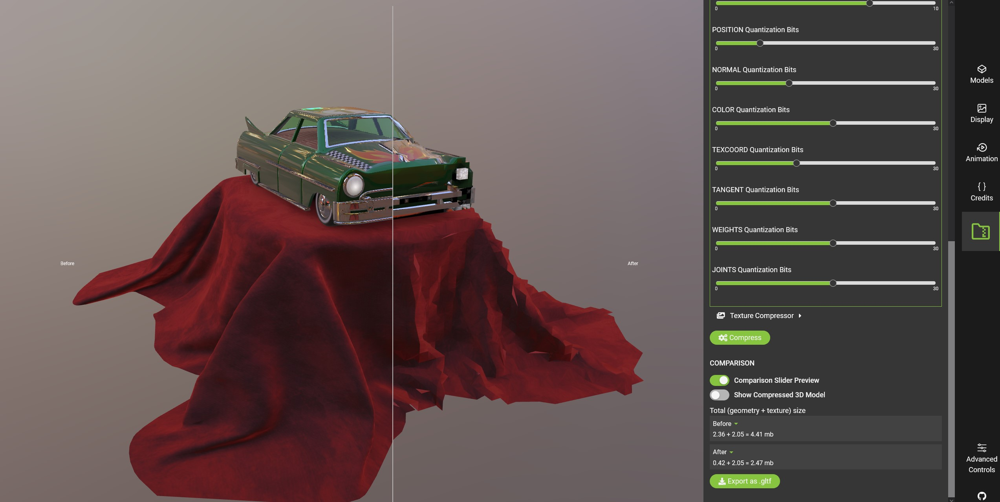

glTF-Compressor
==============================

[](https://phasmatic3d.github.io/glTF-Sample-Viewer-KTX-demo/)

This is the official [Khronos glTF 2.0](https://www.khronos.org/gltf/) image compression project using [WebGL](https://www.khronos.org/webgl/): [glTF-Compressor](https://github.khronos.org/glTF-Compressor-Release/)


Table of Contents
-----------------

- [Version](#version)
- [Credits](#credits)
- [Features](#features)
- [Setup](#setup)
- [Web App](#web-app)

Version
-------

Image compression using KTX 2, JPEG, PNG and WebP.

Credits
-------

Developed by [Phasmatic](https://www.phasmatic.com/). Supported by the [Khronos Group](https://www.khronos.org/).
Original code based on the former [glTF-Sample Viewer](https://github.com/KhronosGroup/glTF-Sample-Viewer) project. 

Features
--------
On top of existing [glTF Sample Viewer features](https://github.com/KhronosGroup/glTF-Sample-Viewer#features), this project adds functionality for:
- [x] [EXT_texture_webp](https://github.com/KhronosGroup/glTF/tree/main/extensions/2.0/Vendor/EXT_texture_webp)
- [x] Images preview
- [x] 3D mesh comparison (original/compressed images)
- [x] 2D image comparison (original/compressed images) with zoom operation
- [x] KTX 2 encoding
- [x] JPEG encoding
- [x] PNG encoding
- [x] WebP encoding
- [x] Model export (gltf, gltf-embedded, glb)

Setup
-----

For local usage and debugging, please follow these instructions:

0. Make sure [Git LFS](https://git-lfs.github.com) is installed.

1. Checkout the [`main`](../../tree/main) branch

2. Pull the submodules for the required [glTF sample models](https://github.com/KhronosGroup/glTF-Sample-Models) and [environments](https://github.com/KhronosGroup/glTF-Sample-Environments) `git submodule update  --init --recursive`

Web App
-------

You can find an example application for the glTF-Compressor in the [app_web subdirectory of the glTF-Compressor repository](app_web). A live demo can be found at [https://github.khronos.org/glTF-Compressor-Release/](https://github.khronos.org/glTF-Compressor-Release/).

**Running a local version**

Open a terminal window in the repository root an run the following commands
```
cd app_web
npm install 
npm run dev
```

now you can access glTF-Compressor with Chrome or Firefox at the URL [`http://localhost:8000`](http://localhost:8000)

