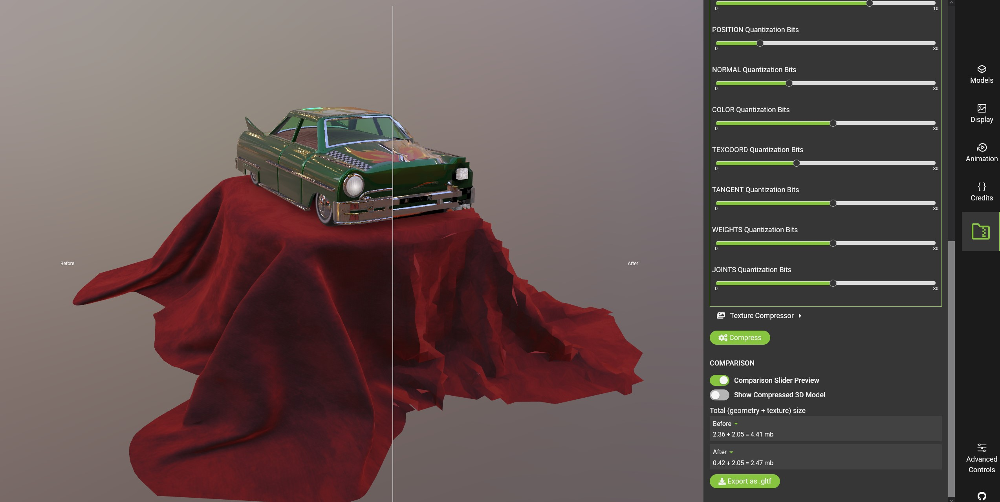

glTF-Compressor
==============================

[](https://phasmatic3d.github.io/glTF-Sample-Viewer-KTX-demo/)

This is the official [Khronos glTF 2.0](https://www.khronos.org/gltf/) image and geometry compression project using [WebGL](https://www.khronos.org/webgl/): [glTF-Compressor](https://github.khronos.org/glTF-Compressor-Release/)

Link to the live [glTF-Compressor](https://github.khronos.org/glTF-Compressor-Release/)


Table of Contents
-----------------

- [Version](#version)
- [Credits](#credits)
- [Features](#features)
- [Setup](#setup)
- [Web App](#web-app)

Version
-------

Texture compression using KTX2, JPEG, PNG and WebP.

Geometry compression using DRACO, MeshOpt and MeshQuantization.

Credits
-------

Developed by [Phasmatic](https://www.phasmatic.com/). Supported by the [Khronos Group](https://www.khronos.org/).
Original code based on the [glTF-Sample Viewer](https://github.com/KhronosGroup/glTF-Sample-Viewer) project. 

Features
--------
On top of existing [glTF Sample Viewer](https://github.com/KhronosGroup/glTF-Sample-Viewer?tab=readme-ov-file#usage) features, this project adds functionality for:
- [x] 3D mesh comparison (original/compressed images and geometry)
- [x] 2D image comparison (original/compressed images) with zoom operation
- [x] JPEG texture compression
- [x] PNG texture compression
- [x] KTX2 texture compression via [KHR_texture_basisu](https://github.com/KhronosGroup/glTF/blob/main/extensions/2.0/Khronos/KHR_texture_basisu/README.md)
- [x] WebP texture compression via [EXT_texture_webp](https://github.com/KhronosGroup/glTF/tree/main/extensions/2.0/Vendor/EXT_texture_webp)
- [x] Model compression via [EXT_meshopt_compression](https://github.com/KhronosGroup/glTF/blob/main/extensions/2.0/Vendor/EXT_meshopt_compression/README.md)
- [x] Model compression via [KHR_draco_mesh_compression](https://github.com/KhronosGroup/glTF/blob/main/extensions/2.0/Khronos/KHR_draco_mesh_compression/README.md)
- [x] Model compression via [KHR_mesh_quantization](https://github.com/KhronosGroup/glTF/blob/main/extensions/2.0/Khronos/KHR_mesh_quantization/README.md)
- [x] Model export with textures (glTF, glTF-embedded, GLB)

Setup
-----

For local usage and debugging, please follow these instructions:

0. Make sure [Git LFS](https://git-lfs.github.com) is installed.

1. Checkout the [`main`](../../tree/main) branch

2. Pull the submodules for the required [glTF Sample Assets](https://github.com/KhronosGroup/glTF-Sample-Assets) and [environments](https://github.com/KhronosGroup/glTF-Sample-Environments) `git submodule update  --init --recursive`

Web App
-------

You can find an example application for the glTF-Compressor in the [app_web subdirectory of the glTF-Compressor repository](app_web). The live app can be found here: [glTF-Compressor](https://github.khronos.org/glTF-Compressor-Release/).

**Running a local version**

Open a terminal window in the repository root an run the following commands
```
cd app_web
npm install 
npm run dev
```

The glTF-Compressor can be accessed live with Chrome or Firefox at the URL [[glTF-Compressor](https://github.khronos.org/glTF-Compressor-Release/)](https://github.khronos.org/glTF-Compressor-Release/)

